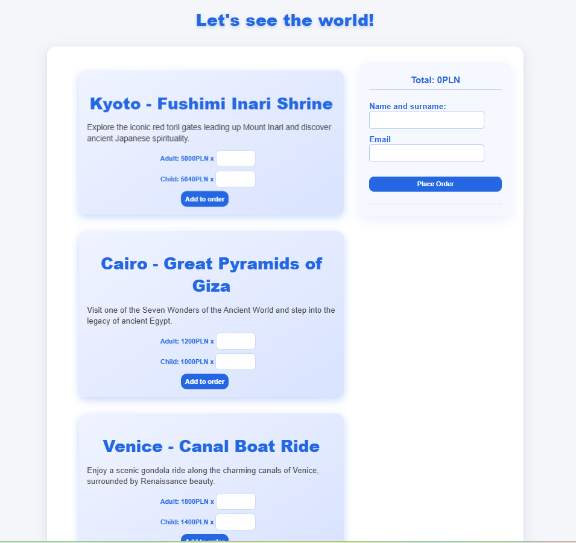
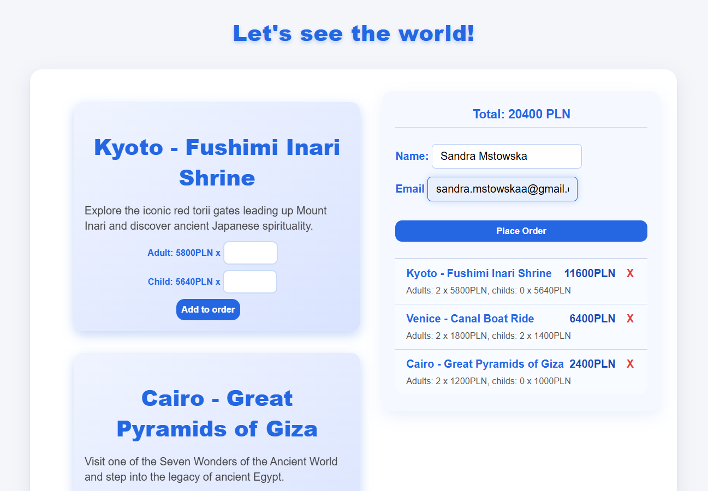
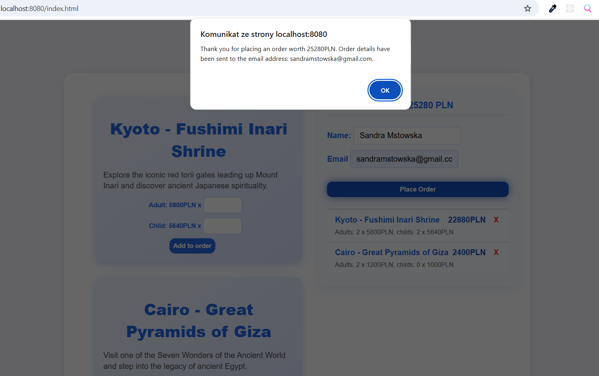
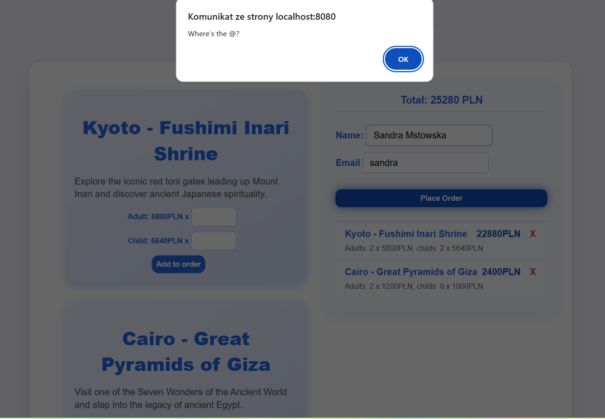
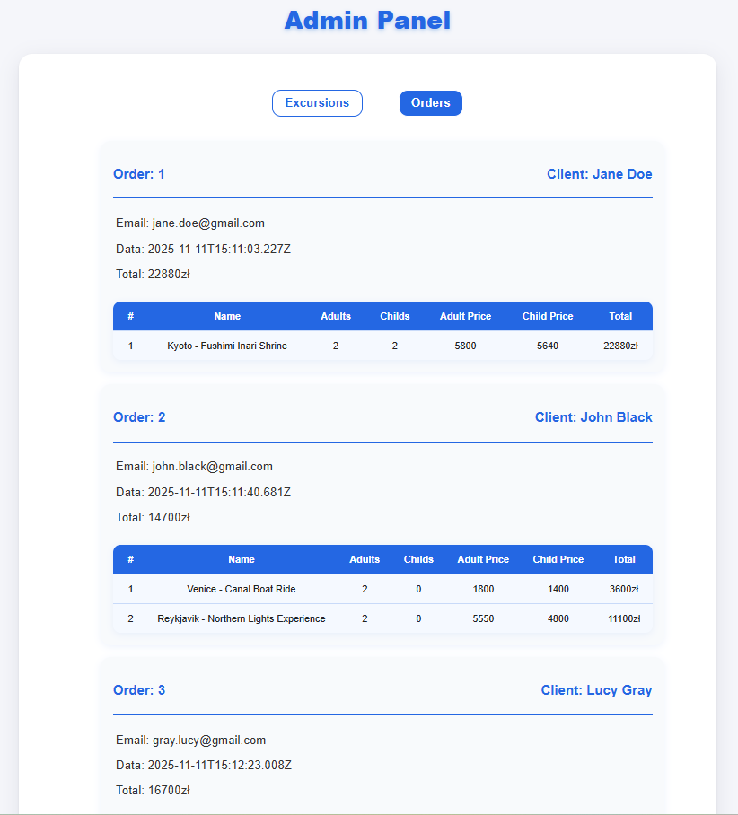
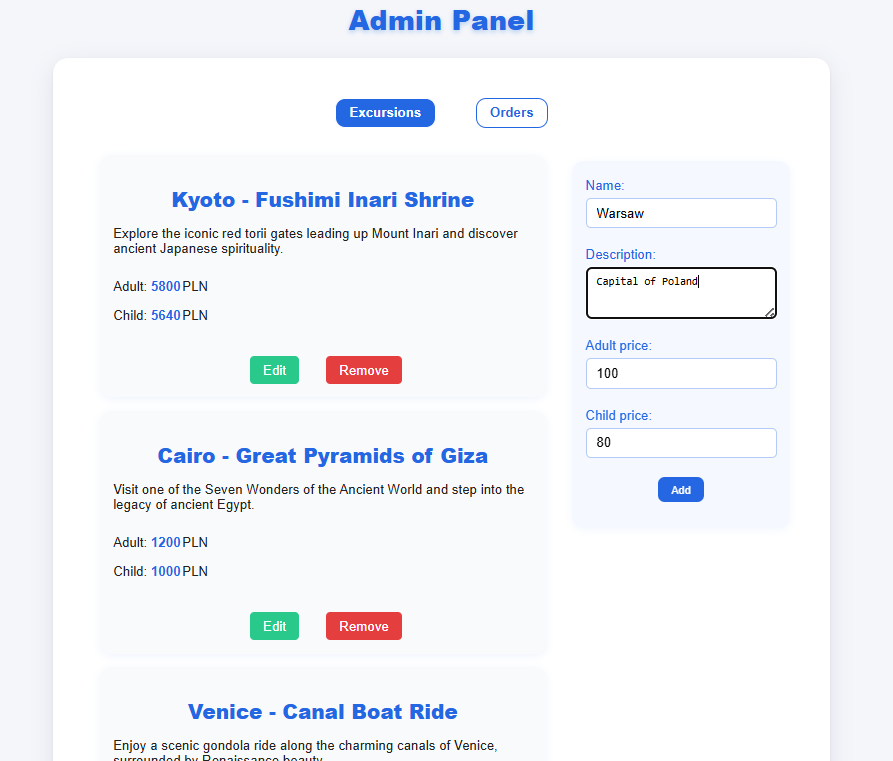

# Let's See the World! — Excursions Booking App

## About the project 
This web application allows users to book travel excursions and includes separate client and admin panels. It is built using JavaScript with the Fetch API to communicate with a local JSON-based backend (`excursions.json`). 
Clients can browse available excursions, select quantities for adults and children, and place orders. 
The admin panel enables management of excursions by adding, editing, and deleting them, as well as viewing customer orders.

 ## 🧩 Features  
- Dynamic loading and display of excursions from a JSON backend  
- Client-side basket management with add and remove functionality  
- Form validation for name, email, and number inputs to ensure correct order submission  
- Admin panel for managing excursions and viewing all orders  
- Responsive and visually appealing UI styled with CSS  
- Uses modern JavaScript features, including promises and async/await for asynchronous operations  

## 🛠️Tech Stack 
- JavaScript (ES6 modules, Fetch API)  
- CSS for styling and responsive design  
- JSON server to mock the backend API using `excursions.json`  
- HTML5 semantic elements  

## ✨  What I Learned
- Working with asynchronous JavaScript, including Fetch API, promises, and async/await to handle API requests efficiently.
- Implementing dynamic DOM manipulation to update the UI based on user interactions and backend data.
- Managing form validation and error handling to ensure a smooth and user-friendly ordering process.
- Structuring a frontend project with modular JavaScript for better maintainability and scalability.
- Understanding the basics of creating and interacting with a mock RESTful API using JSON Server.
- Enhancing problem-solving skills by debugging and refining both client and admin functionalities.

### Installation and Running the App  
- git clone https://github.com/MstowskaSandra/ExcursionsApp.git
- cd ExcursionsApp
- npm start
- json-server --watch ./data/excursions.json
- Open in browser:
Client: http://localhost:8080/index.html
Admin: http://localhost:8080/admin.html

## About Me
Junior frontend developer with a passion for playful user interfaces and productivity tools. I enjoy creating vibrant, accessible apps and learning best practices for API integration.

## Why you should consider me
I’m a self-driven learner, passionate about front-end development. Even though I’m new to commercial work, this project shows I’ve got the skills and mindset to create great websites. I’m ready to grow and take on challenges as a junior front-end developer.

## Client Panel

## Admin Panel

